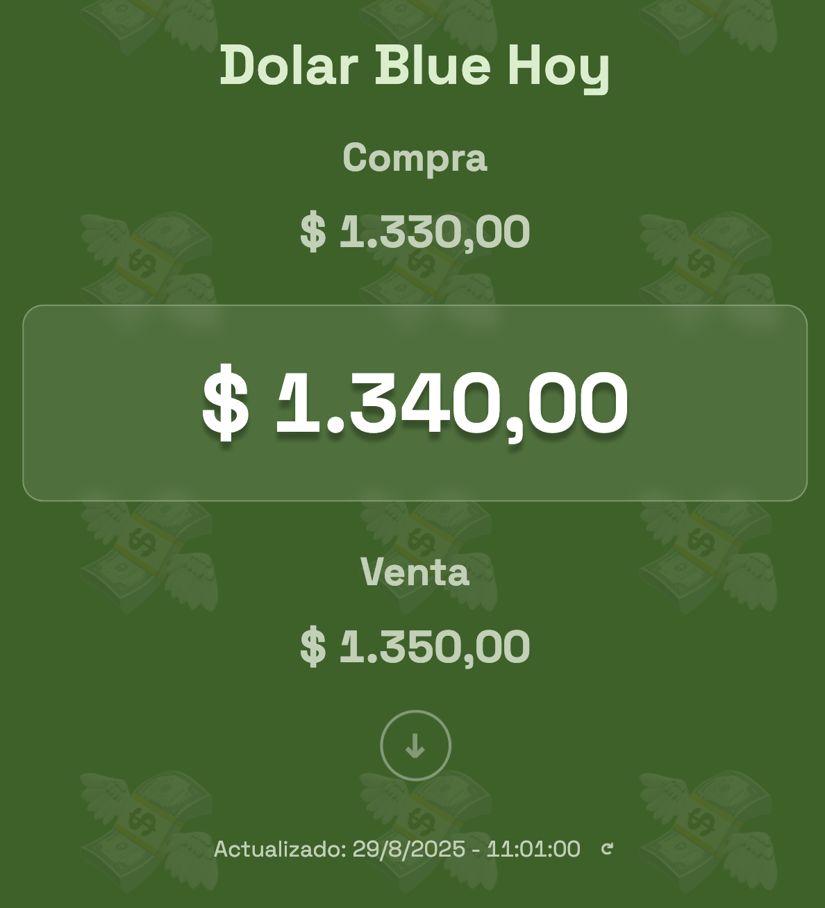
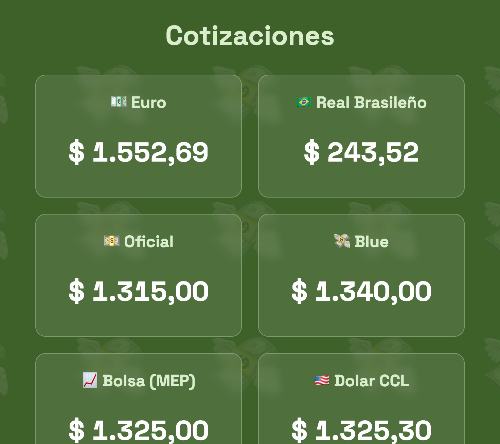
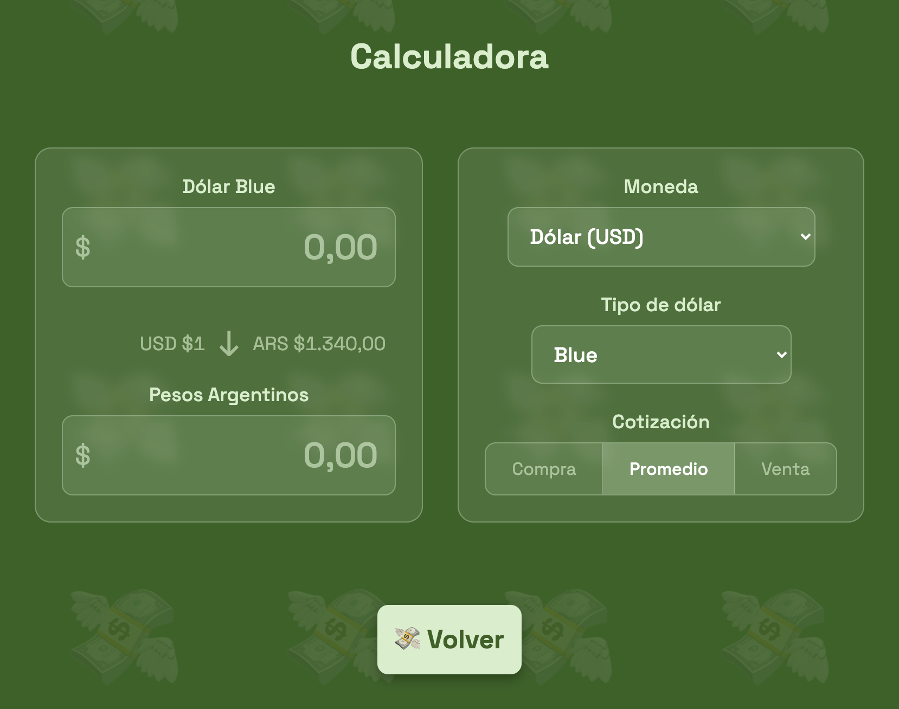
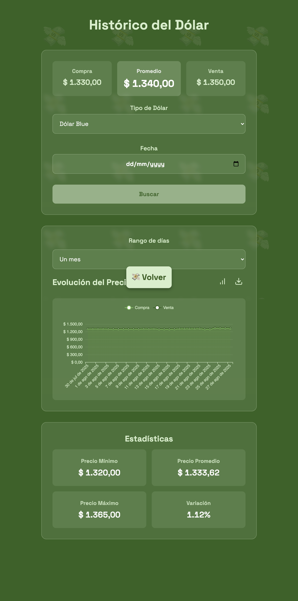

# Dólar Blue Hoy 💸

[](./public/index.html)
[](https://firebase.google.com/products/hosting)
[](./public/manifest.json)

Una app simple y rápida para consultar el valor del dólar blue en Argentina, ver otras cotizaciones, calcular conversiones y explorar el histórico de precios.

---

## Demo

- Web: `https://promedioblue.web.app`

---

## Capturas de pantalla

<div style="display: grid; grid-template-columns: repeat(4, 1fr); gap: 10px;">
  
  
  
  
  
</div>

---

## Características

- Cotización del dólar blue y otros tipos de cambio en tiempo real gracias a <a href="https://dolarapi.com/">dolarapi.com</a>
- Calculadora de conversión entre monedas extranjeras y pesos argentinos
- Histórico de precios con gráficos interactivos y estadísticas

---

## Páginas principales

- Inicio: `public/index.html`
- Cotizaciones: `public/cotizaciones/cotizaciones.html`
- Calculadora: `public/calculadora/calculadora.html`
- Histórico: `public/historico/historico.html`

---

## Tecnologías y servicios

- HTML, CSS, JavaScript (vanilla)
- Hosting: Firebase Hosting
- APIs y librerías:
  - Dólar API: `https://dolarapi.com/v1/dolares/`
  - Gráficos: ECharts
  - UI/UX: SweetAlert2, Lucide Icons
  - Donaciones: <a href="https://cafecito.app/losio">Cafecito</a>

---

## Ejecutar localmente

Opción 1: cualquier servidor estático

```bash
# Clonar
git clone https://github.com/<tu-usuario>/promedioBlue.git
cd promedioBlue

# Servir la carpeta public (elige una alternativa)
# con http-server
npx http-server public -p 3000
# o con serve
npx serve public -l 3000
# o con Python
cd public && python3 -m http.server 3000
```

Abrí `http://localhost:3000` en tu navegador.

Opción 2: emular con Firebase Hosting

```bash
npm i -g firebase-tools
firebase login
firebase emulators:start --only hosting
```

---

## Despliegue

Firebase Hosting (recomendado)

```bash
# Una sola vez (si aún no configuraste el proyecto remoto)
firebase use --add

# Desplegar
firebase deploy --only hosting
```

GitHub Pages (alternativa)

- Publicá el contenido de `public/` en la rama `gh-pages` o configurá Pages para servir desde `/public`.
- Actualizá los paths si tu base path cambia.

---

## Estructura del proyecto

```
public/
  index.html
  main.js
  style.css
  calculadora/
  cotizaciones/
  historico/
```

No hay paso de build: es un sitio estático listo para servir.

---

## Configuración

- No se requieren claves de API para `dolarapi.com` (endpoint público usado por `public/main.js`).
- Ajustá metadatos Open Graph/Twitter en `public/index.html` si cambiás dominios o recursos.

---

## Contribuir

1. Hacé un fork del repositorio
2. Creá una rama: `git checkout -b feature/mi-mejora`
3. Commit: `git commit -m "feat: agrego <tu mejora>"`
4. Push: `git push origin feature/mi-mejora`
5. Abrí un Pull Request y te lo reviso

---

## Agradecimientos

- `dolarapi.com` por la API pública
- `ECharts`, `SweetAlert2`, `Lucide` por las librerías usadas
- `Firebase Hosting` por el despliegue simple

---

Hecho con 💚 by Lauti
